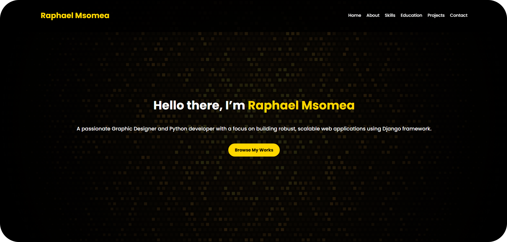

A modern, responsive **portfolio website** built with **pure HTML & CSS** for the **PLP Academy Hackathon**.



## Live Demo
**[View Portfolio Here](https://msomea.github.io/portfolio/)**

## Features
- **Gold & Black Modern Theme** 
- **Smooth Scrolling Navigation** 
- **CSS Animations & Hover Effects** 
- **Fully Responsive for Mobile & Desktop**
- Sections:
  - Hero
  - About Me
  - Skills
  - Education (with downloadable CV)
  - Interests
  - Projects
  - Contact Form

## Screenshots
| Hero Section | About Section |
|--------------|---------------|
|  |  |

| Skills Section   | Education Section |
|------------------|-------------------|
|  |  |

| Project Section  | Contact Section |
|------------------|-------------------|
|  |  |

## Built With
- **HTML5** → Semantic structure
- **CSS3** → Responsive layout, animations and styling
- **GitHub Pages** → Hosting & deployment

## How To Run on your local computer
```bash
# Clone this repo
git clone https://github.com/msomea/portfolio.git

# Open index.html in your browser
```
## Deployment
This site is deployed on **GitHub Pages**:
**[https://msomea.github.io/portfolio/](https://msomea.github.io/portfolio/)**


## Contact
- **Name:** Raphael Msomea
- **Email:** msomearaphael@gmail.com
- **Portfolio:** [Live Link](https://msomea.github.io/portfolio/)

### Hackathon Submission
This project was created for the **PLP Academy Hackathon (July 30th – Aug 3rd, 2025)**.

